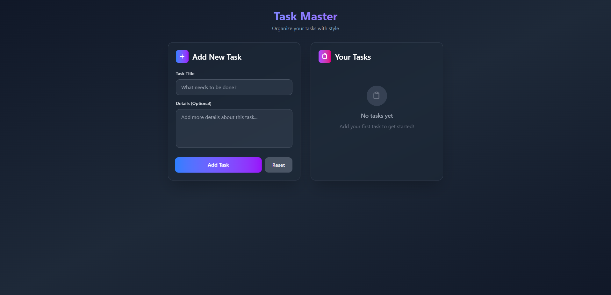

# 📝 Todo App

A simple and modern **Todo Application** built with **React**, **Vite**, and **Tailwind CSS**.  
This project is designed as a beginner-friendly project for learning React fundamentals while maintaining a clean code structure and responsive UI.

---

## 🚀 Features

- ➕ Add new todos  
- ✅ Mark todos as completed  
- ❌ Delete todos  
- 📦 Data persistence with browser storage *(optional if implemented with localStorage)*  
- ⚡ Super-fast build & hot reload with **Vite**  
- 🎨 Stylish and responsive UI with **Tailwind CSS**  
- 🛠️ Code linting with **ESLint**

---

## 🏗️ Tech Stack

- **React.js** – Frontend library  
- **Vite** – Development server & bundler  
- **Tailwind CSS** – Styling framework  
- **ESLint** – Linting & code style  
- **Node.js + npm** – Package management  

---

## 📂 Project Structure

```
todo-app/
├── public/                 # Static assets
├── src/                    # React components & app logic
│   ├── components/         # Reusable UI components
│   ├── App.jsx             # Main app entry
│   ├── main.jsx            # React root rendering
│   └── index.css           # Global styles
├── index.html              # Root HTML file
├── package.json            # Project dependencies & scripts
├── vite.config.js          # Vite configuration
├── tailwind.config.js      # Tailwind CSS configuration
├── eslint.config.js        # ESLint rules
└── README.md               # Project documentation
```

---

## ⚙️ Installation & Setup

1. **Clone the repository**
   ```bash
   git clone https://github.com/AmitDev15/todo-app.git
   cd todo-app
   ```

2. **Install dependencies**
   ```bash
   npm install
   ```

3. **Start development server**
   ```bash
   npm run dev
   ```

   App will be running at:  
   👉 `http://localhost:5173`

---

## 📖 Usage

1. Open the app in your browser.  
2. Add new tasks by typing in the input field and pressing Enter.  
3. Mark tasks as complete or delete them as needed.  
4. *(Optional)* Todos are stored in **localStorage** so they persist across reloads.  

---

## 📸 Screenshots

Example layout:

- **Home Page**  
  

---

## 🧪 Scripts

Available npm commands:

- `npm run dev` → Start development server  
- `npm run build` → Build for production  
- `npm run preview` → Preview production build  
- `npm run lint` → Run ESLint checks  

---

## 🤝 Contributing

Contributions, issues, and feature requests are welcome!  
Feel free to **open an issue** or **submit a pull request**.

1. Fork the repo  
2. Create your feature branch (`git checkout -b feature/new-feature`)  
3. Commit your changes (`git commit -m 'Add new feature'`)  
4. Push to the branch (`git push origin feature/new-feature`)  
5. Open a Pull Request  

---

## 📜 License

This project is licensed under the **MIT License**.  
See the [LICENSE](./LICENSE) file for details.

---

## 🙌 Acknowledgments

- [React](https://react.dev/) – UI library  
- [Vite](https://vitejs.dev/) – Lightning-fast frontend tooling  
- [Tailwind CSS](https://tailwindcss.com/) – Styling framework  
- Inspiration from modern Todo app designs  

---

### ⭐ Don’t forget to give the repo a star if you find it helpful!
